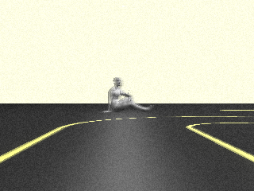
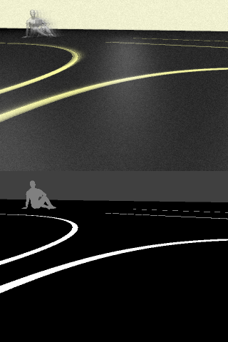
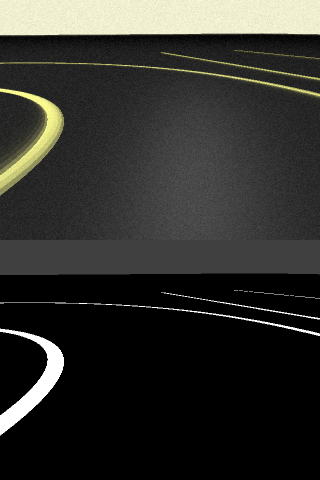
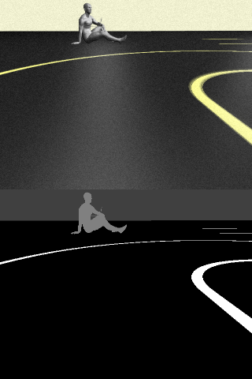

# Road Simulator

This project is for generating datasets for training autonomous vehicles. Although there are many datasets on the Internet, most of them are not controllable. Therefore, I started this project to create a fully-controllable dataset freely.

You can get the simulation images (look like real world) by selecting proper material and light. Then, just by removing lights and changing all materials to `MeshBasicMaterial` with different color by object, you can get perfect labels for simulation image.

- To generate label images efficiently (instead of changing every material), I just wrote my custom shader material by editting original shader(provided by THREE.js) a little.

It does not requires any dependencies except a modern web browser such as Chrome. If you are currently using chrome, you can visit [my simulation](https://unknownpgr.github.io/road-simulator/index.html) and see how it works!

Since this project was created using `WebGL`(`THREE.js`), you can apply almost any effects available with them. Below are some examples.

- Image resize
- Add noise on image
- Apply [blur](https://stackoverflow.com/questions/15354117/three-js-blur-the-frame-buffer) (including [motion blur](https://codepen.io/tjezidzic/pen/LMppKp)) effect
- More realistic rendering with [ray tracing(!)](http://madebyevan.com/webgl-path-tracing/)
- [Physics simulation](https://chandlerprall.github.io/Physijs/)
- Add noise on lane (so that the lanes are winding)
- Generating label for machine learning
- Add some other vehicles

...And everything you can imagine.

## Comparation

In this section, You will probably realize that the simulated image is a bit yellow(?) and blurry. It is actually intended. This makes it difficult to distinguish between the background and the lane, so that the AI trained with this dataset will work well in environments where lanes and backgrounds are confusing.

### Simulation Result

Below are some result from the simulation.

### Real-World Result

Below are some images from real world camera (on toy car).

## Label Generating

Below are generated image-label tuple. I generated very blurry images and their label images. Because the label images are generated directly from model(before shader), they are very clear.

## Project Structure

- `index.js` : Node.js server, receive generated image and statically serve files.
- `dataset` : Generated images will be saved in this directory. The default save path is `dataset/imgs`.
- `traning/preprocessor.py` : Generate csv dataset file from data in `dataset` directory.

## Requirements

- `Node.js`
- `Python`, `OpenCV` (only for preprocessing, not required for just data generating.)
- Modern browser such as `Chrome`.
