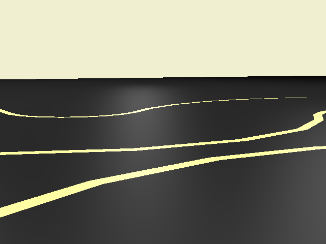
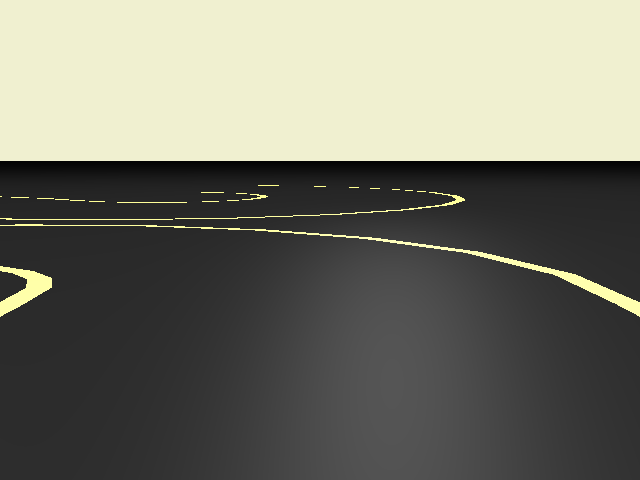
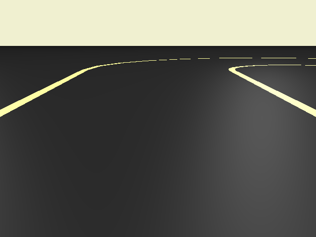
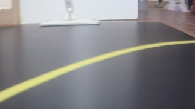
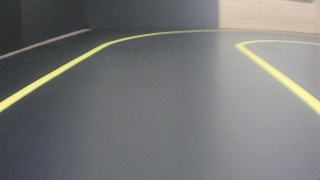
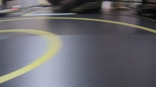

# Read Simulator

This project is for creating a dataset for training autonomous vehicles. Although there are many datasets on the Internet, most of them are not controllable. Therefore, I started this project to create a fully controllable dataset freely.

You can get the simulation images (look like real world) by selecting proper material and light. Then, just by removing lights and changing all materials to `MeshBasicMaterial` with different color by object, you can get perfect labels for simulation image.

It does not requires any dependency except a modern web browser such as Chrome. If you are currently using chrome, you can visit [my simulation](https://unknownpgr.github.io/road-simulator/index.html) and see how it works!

Since this project was created using `WebGL`+`THREE.js`, you can apply almost any effect. Below are some examples.

- Image resize
- Add noise on image
- Apply [blur](https://stackoverflow.com/questions/15354117/three-js-blur-the-frame-buffer) (including [motion blur](https://codepen.io/tjezidzic/pen/LMppKp)) effect
- More realistic rendering with [ray tracing(!!!)](http://madebyevan.com/webgl-path-tracing/)
- [Physics simulation](https://chandlerprall.github.io/Physijs/)
- Add noise on lane (so that the lanes are winding)
- Add some other vehicles

...And everything you can imagine.

# Comparation

In this section, You will probably realize that the simulated image is a bit yellow. This makes it difficult to distinguish between the background and the lane. By using these datasets, AI trained with this dataset will work well in environments where lanes and backgrounds are confusing.

## Simulation Result

Below are some result from the simulation.

## Real-World Result

Below are real some images from camera (on toy car).

